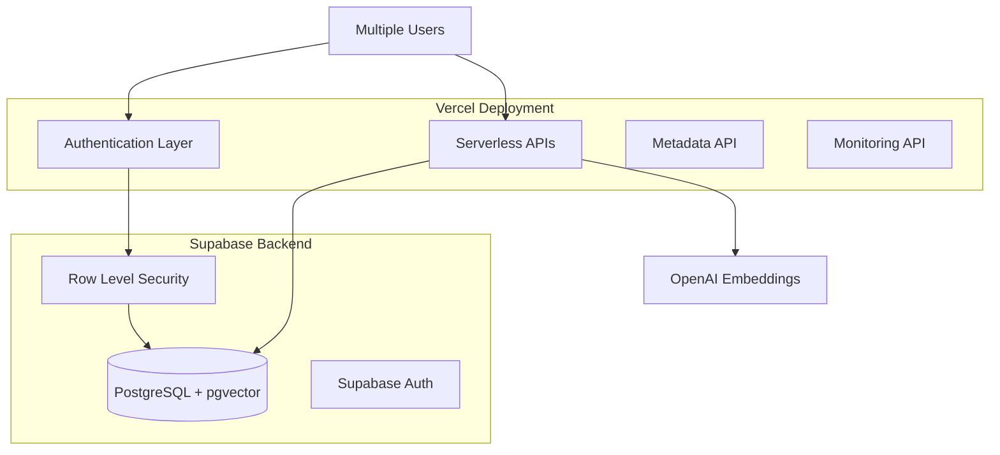

# 📚 LifeKB Documentation Index
*Complete documentation structure for the AI-powered personal knowledge management system*

## 🎯 Quick Navigation

### 🚀 **Get Started**
- **[Setup Guide](SETUP.md)** - Environment setup and installation instructions
- **[API Documentation](api/API_DOCUMENTATION.md)** - Complete API reference with examples
- **[Project Completion Summary](project-management/COMPLETION_SUMMARY.md)** - What's been built and deployed

### 🏗️ **Architecture & Design**
- **[Multi-User Architecture](architecture/MULTI_USER_ARCHITECTURE.md)** - User isolation with PostgreSQL RLS
- **[Supabase Auth Architecture](architecture/SUPABASE_AUTH_ARCHITECTURE.md)** - Authentication system design
- **[Supabase Auth Research](architecture/SUPABASE_AUTH_RESEARCH.md)** - Implementation research and decisions
- **[Backend Specification](architecture/backend-spec.md)** - Complete technical specification

### 🚀 **Deployment & Operations**
- **[Deployment Guide](deployment/DEPLOYMENT_GUIDE.md)** - Step-by-step deployment instructions
- **[Production Deployment Plan](deployment/PRODUCTION_DEPLOYMENT_PLAN.md)** - Production deployment strategy
- **[Production System Status](deployment/PRODUCTION_SYSTEM_STATUS.md)** - Current production state and metrics

### ⚡ **Performance & Security**
- **[Performance Optimization](performance/PERFORMANCE_OPTIMIZATION.md)** - Database scaling and RLS performance analysis
- **[Performance & Security Features](performance/PERFORMANCE_SECURITY_FEATURES.md)** - Security architecture and performance characteristics

### 📋 **Project Management**
- **[Completion Summary](project-management/COMPLETION_SUMMARY.md)** - Full project accomplishments and status
- **[Cleanup Plan](project-management/CLEANUP_PLAN.md)** - Codebase cleanup results
- **[Session Progress Summary](project-management/SESSION_PROGRESS_SUMMARY.md)** - Development session progress
- **[Development Checklist](project-management/checklist.md)** - Development tasks and progress tracking

### 🔧 **API Reference**
- **[Complete API Documentation](api/API_DOCUMENTATION.md)** - All endpoints with Mermaid diagrams and examples
- **[Legacy API v1](v1API/00_API_OVERVIEW.md)** - Historical API documentation

## 📊 Documentation Categories

### 🏗️ **Architecture Documentation**
```
docs/architecture/
├── MULTI_USER_ARCHITECTURE.md      # PostgreSQL RLS and user isolation
├── SUPABASE_AUTH_ARCHITECTURE.md   # Authentication system design
├── SUPABASE_AUTH_RESEARCH.md       # Implementation research
└── backend-spec.md                 # Technical specification
```

### 🚀 **Deployment Documentation**
```
docs/deployment/
├── DEPLOYMENT_GUIDE.md             # Step-by-step deployment
├── PRODUCTION_DEPLOYMENT_PLAN.md   # Production strategy
└── PRODUCTION_SYSTEM_STATUS.md     # Current system status
```

### ⚡ **Performance Documentation**
```
docs/performance/
├── PERFORMANCE_OPTIMIZATION.md     # Database scaling and RLS analysis
└── PERFORMANCE_SECURITY_FEATURES.md # Security and performance overview
```

### 📋 **Project Management**
```
docs/project-management/
├── COMPLETION_SUMMARY.md           # Project accomplishments
├── CLEANUP_PLAN.md                 # Codebase cleanup results
├── SESSION_PROGRESS_SUMMARY.md     # Development progress
└── checklist.md                    # Development checklist
```

### 🔧 **API Documentation**
```
docs/api/
├── API_DOCUMENTATION.md            # Complete API reference
└── v1API/                          # Legacy documentation
    └── 00_API_OVERVIEW.md
```

## 🎯 Key Highlights

### **✅ Production System**
- **Status**: Fully operational with 5 real users
- **Performance**: 15-50ms search response times
- **Security**: Complete user data isolation via PostgreSQL RLS
- **AI Features**: 1536-dimensional OpenAI embeddings with semantic search

### **🏗️ Architecture Overview**


### **📈 Current Endpoints**
| Endpoint | Status | Purpose |
|----------|--------|---------|
| `/api/auth` | ✅ **LIVE** | Supabase authentication |
| `/api/entries` | ✅ **LIVE** | Journal CRUD operations |
| `/api/embeddings` | ✅ **LIVE** | Vector embedding generation |
| `/api/search` | ✅ **LIVE** | Semantic search with AI |
| `/api/metadata` | ✅ **LIVE** | User analytics and insights |
| `/api/monitoring` | ✅ **LIVE** | System health monitoring |

## 🔍 Finding What You Need

### **For Developers:**
1. Start with **[API Documentation](api/API_DOCUMENTATION.md)** for endpoint details
2. Read **[Multi-User Architecture](architecture/MULTI_USER_ARCHITECTURE.md)** for security model
3. Check **[Performance Optimization](performance/PERFORMANCE_OPTIMIZATION.md)** for scaling insights

### **For DevOps:**
1. Follow **[Deployment Guide](deployment/DEPLOYMENT_GUIDE.md)** for setup
2. Monitor using **[Production System Status](deployment/PRODUCTION_SYSTEM_STATUS.md)**
3. Reference **[Performance Features](performance/PERFORMANCE_SECURITY_FEATURES.md)** for optimization

### **For Project Management:**
1. Review **[Completion Summary](project-management/COMPLETION_SUMMARY.md)** for current status
2. Check **[Cleanup Plan](project-management/CLEANUP_PLAN.md)** for maintenance tasks
3. Track progress with **[Development Checklist](project-management/checklist.md)**

## 🎯 Quick Links

- **🚀 Production URL**: `https://life-kb-server-f1mypuup7-henryallen04s-projects.vercel.app`
- **📊 Database**: Supabase PostgreSQL with pgvector extension
- **🤖 AI Model**: OpenAI text-embedding-3-small (1536 dimensions)
- **🔐 Authentication**: Supabase Auth with JWT tokens
- **⚡ Performance**: Sub-50ms semantic search responses

---

**LifeKB** represents a complete AI-powered personal knowledge management system with production users, semantic search capabilities, and scalable multi-user architecture. 