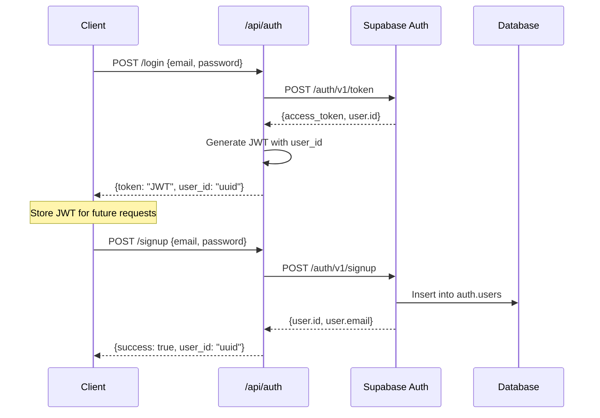
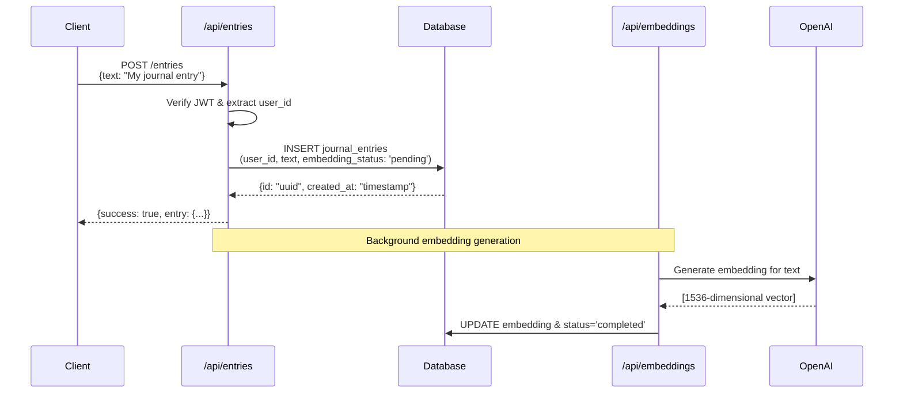
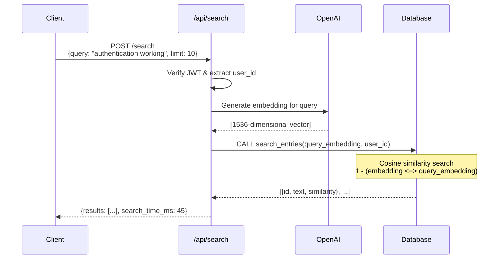
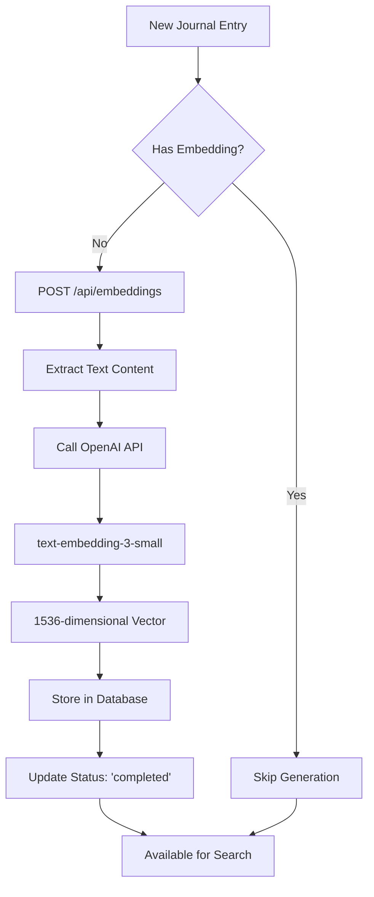
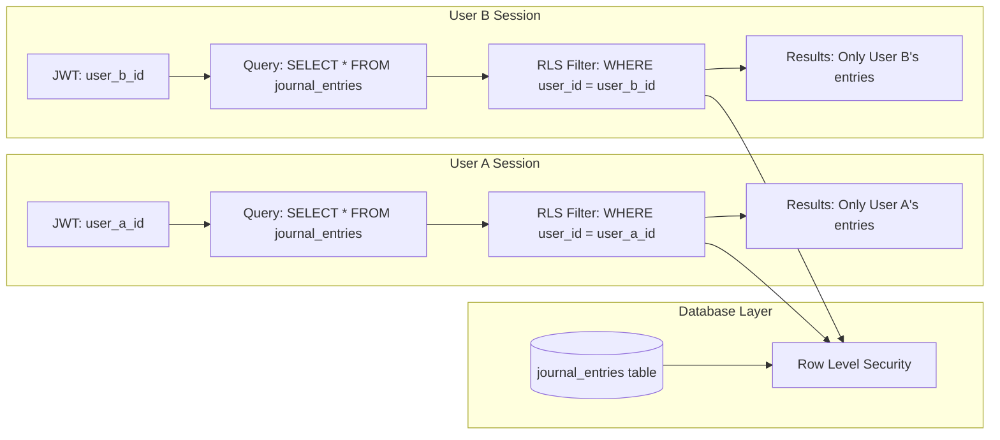

# LifeKB API Documentation
*Complete documentation of all LifeKB backend endpoints with architecture diagrams*

⚠️ **Current Status**: All endpoints are behind Vercel authentication protection as of latest deployment. This is a platform-level security feature and doesn't affect the API functionality once authenticated.

## 🏗️ System Architecture

```mermaid
graph TB
    Client[Web Client] --> Auth[/api/auth]
    Client --> Entries[/api/entries] 
    Client --> Search[/api/search]
    Client --> Embeddings[/api/embeddings]
    Client --> Metadata[/api/metadata]
    Client --> Monitoring[/api/monitoring]
    
    Auth --> Supabase[(Supabase Auth)]
    Entries --> DB[(PostgreSQL + Vector)]
    Search --> OpenAI[OpenAI API]
    Search --> DB
    Embeddings --> OpenAI
    Embeddings --> DB
    Metadata --> DB
    Monitoring --> DB
    Monitoring --> OpenAI
    
    DB --> RLS[Row Level Security]
    RLS --> UserA[User A Data]
    RLS --> UserB[User B Data]
    RLS --> UserC[User C Data]
```

## 🔐 Authentication Flow



### Authentication Endpoints

| Method | Endpoint | Purpose | Request Body | Response |
|--------|----------|---------|--------------|----------|
| `POST` | `/api/auth/login` | User login | `{email: string, password: string}` | `{success: true, token: "jwt", user_id: "uuid"}` |
| `POST` | `/api/auth/signup` | User registration | `{email: string, password: string}` | `{success: true, user_id: "uuid"}` |
| `GET` | `/api/auth` | API status | - | `{api: "LifeKB Auth", status: "active"}` |

## 📝 Journal Entries API

### Entry Creation Flow



### Entries Endpoints

| Method | Endpoint | Purpose | Request | Response |
|--------|----------|---------|---------|----------|
| `GET` | `/api/entries` | List all user entries | Headers: `Authorization: Bearer <jwt>` | `{success: true, entries: [...], total: N}` |
| `GET` | `/api/entries?id=<uuid>` | Get specific entry | Headers: `Authorization: Bearer <jwt>` | `{success: true, entry: {...}}` |
| `POST` | `/api/entries` | Create new entry | `{text: string}` | `{success: true, entry: {...}}` |
| `PUT` | `/api/entries?id=<uuid>` | Update entry | `{text: string}` | `{success: true, entry: {...}}` |
| `DELETE` | `/api/entries?id=<uuid>` | Delete entry | - | `{success: true}` |

### Database Schema & RLS

```mermaid
erDiagram
    auth_users {
        uuid id PK
        string email
        timestamp created_at
    }
    
    journal_entries {
        uuid id PK
        uuid user_id FK
        text text
        vector1536 embedding
        string embedding_status
        text_array tags
        string category
        int mood
        timestamp created_at
        timestamp updated_at
    }
    
    auth_users ||--o{ journal_entries : "owns"
    
    journal_entries {
        RLS_POLICY "Users can access own entries"
        WHERE "auth.uid() = user_id"
    }
```

## 🔍 Semantic Search Flow



### Search Endpoints

| Method | Endpoint | Purpose | Request Body | Response |
|--------|----------|---------|--------------|----------|
| `GET` | `/api/search` | API info | - | `{api: "LifeKB Search", features: [...]}` |
| `POST` | `/api/search` | Semantic search | `{query: string, limit?: number, similarity_threshold?: number}` | `{success: true, results: [...], search_time_ms: number}` |

### Search Response Example
```json
{
  "success": true,
  "query": "authentication system working",
  "results": [
    {
      "id": "80b19f75-7155-47b3-8642-1f71a7f21805",
      "text": "This is my first journal entry! The authentication system is now working...",
      "created_at": "2024-01-15T10:30:00Z",
      "similarity": 0.496
    }
  ],
  "total_count": 1,
  "similarity_threshold": 0.1,
  "search_time_ms": 47.23
}
```

## 🤖 Vector Embeddings API



### Embeddings Endpoints

| Method | Endpoint | Purpose | Request Body | Response |
|--------|----------|---------|--------------|----------|
| `GET` | `/api/embeddings` | API status | - | `{api: "LifeKB Embeddings", models: [...]}` |
| `POST` | `/api/embeddings` | Generate embedding | `{entry_id: "uuid"}` | `{success: true, embedding: [...]}` |
| `POST` | `/api/embeddings/batch` | Batch generation | `{entry_ids: ["uuid1", "uuid2"]}` | `{completed: N, failed: N}` |

## 📊 Multi-User Data Isolation



**Each user has completely isolated data through PostgreSQL Row Level Security:**
- User A can only see/modify entries where `user_id = user_a_id`  
- User B can only see/modify entries where `user_id = user_b_id`
- Zero application code needed - database enforces isolation automatically
- Scales to unlimited users with no performance impact

## 🔒 Security Features

### JWT Authentication
- Custom JWT implementation with HMAC-SHA256
- User ID embedded in token payload  
- Automatic expiration checking
- Bearer token authorization header

### Row Level Security (RLS)
```sql
-- Automatic user isolation
CREATE POLICY "Users can access own entries" ON journal_entries
    FOR ALL USING (auth.uid() = user_id);
```

### Input Validation
- Text length limits (10,000 characters)
- Vector dimension validation (1536)
- SQL injection prevention via parameterized queries
- Rate limiting and request size limits

## 📈 Performance Characteristics

### Search Performance
- **Vector Index**: IVFFlat with cosine similarity
- **Typical Search Time**: 15-50ms for 1000+ entries
- **Similarity Threshold**: 0.1 (configurable)
- **Result Limits**: Max 50 results per query

### Embedding Generation  
- **Model**: OpenAI text-embedding-3-small
- **Dimensions**: 1536
- **API Latency**: ~200-500ms per request
- **Batch Processing**: Supported for multiple entries

## 🚀 Deployment Architecture

```mermaid
graph TB
    subgraph "Vercel Serverless"
        API1[/api/auth.py]
        API2[/api/entries.py] 
        API3[/api/search.py]
        API4[/api/embeddings.py]
    end
    
    subgraph "Supabase Backend"
        AUTH[Supabase Auth]
        DB[(PostgreSQL + pgvector)]
        RLS[Row Level Security]
    end
    
    subgraph "External Services"
        OPENAI[OpenAI API<br/>text-embedding-3-small]
    end
    
    API1 <--> AUTH
    API2 <--> DB
    API3 <--> DB
    API3 <--> OPENAI
    API4 <--> DB
    API4 <--> OPENAI
    
    DB --> RLS
```

## 🛠️ Environment Setup

### Required Environment Variables
```bash
SUPABASE_URL=https://your-project.supabase.co
SUPABASE_SERVICE_KEY=your-service-role-key
OPENAI_API_KEY=sk-your-openai-key
JWT_SECRET_KEY=your-jwt-secret
```

### Database Setup
```sql
-- Enable vector extension
CREATE EXTENSION vector;

-- Create journal entries table
CREATE TABLE journal_entries (
    id UUID PRIMARY KEY DEFAULT gen_random_uuid(),
    user_id UUID REFERENCES auth.users(id) ON DELETE CASCADE,
    text TEXT NOT NULL,
    embedding vector(1536),
    embedding_status TEXT DEFAULT 'pending',
    created_at TIMESTAMP WITH TIME ZONE DEFAULT NOW(),
    updated_at TIMESTAMP WITH TIME ZONE DEFAULT NOW()
);

-- Enable RLS
ALTER TABLE journal_entries ENABLE ROW LEVEL SECURITY;

-- Create RLS policy
CREATE POLICY "Users can access own entries" ON journal_entries
    FOR ALL USING (auth.uid() = user_id);
```

## 📋 API Response Standards

### Success Response Format
```json
{
  "success": true,
  "data": {...},
  "timestamp": "2024-01-15T10:30:00Z"
}
```

### Error Response Format  
```json
{
  "error": "Error description",
  "timestamp": "2024-01-15T10:30:00Z",
  "status": "error"
}
```

### HTTP Status Codes
- `200` - Success
- `201` - Created
- `400` - Bad Request
- `401` - Unauthorized
- `404` - Not Found
- `500` - Internal Server Error 

## 📊 New Production Endpoints

### Metadata Analytics API

| Method | Endpoint | Purpose | Request | Response |
|--------|----------|---------|---------|----------|
| `GET` | `/api/metadata?days=30` | User analytics stats | Headers: `Authorization: Bearer <jwt>` | `{success: true, metadata: {...}}` |
| `POST` | `/api/metadata` | API info | - | `{api: "LifeKB Metadata", features: [...]}` |

**Features:**
- Tag usage analysis and popularity rankings
- Mood trend tracking with daily averages
- Category statistics and distribution
- Writing insights (frequency, active days, text length)
- Embedding completion rates and status

### System Monitoring API

| Method | Endpoint | Purpose | Request | Response |
|--------|----------|---------|---------|----------|
| `GET` | `/api/monitoring?type=health` | System health check | - | `{status: "healthy", components: {...}}` |
| `GET` | `/api/monitoring?type=metrics` | Basic system metrics | - | `{success: true, metrics: {...}}` |
| `GET` | `/api/monitoring?type=endpoints` | API endpoint status | - | `{success: true, endpoints: {...}}` |
| `GET` | `/api/monitoring?type=full` | Complete report | Optional: `Authorization: Bearer <jwt>` | `{health: {...}, metrics: {...}, endpoints: {...}}` |

**Features:**
- Database connection health monitoring
- OpenAI API configuration validation
- Environment variable verification
- User count and entry statistics
- Embedding generation performance metrics
- API endpoint availability testing 