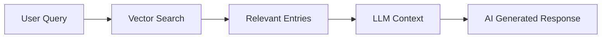

# Multi-User Architecture & Semantic Search

## 🏗️ Multi-User Database Architecture

### Row Level Security (RLS) Implementation

The LifeKB backend is designed to support **unlimited users** with complete data isolation using PostgreSQL's Row Level Security (RLS):

#### Database Schema Design
```sql
-- Each journal entry belongs to a specific user
CREATE TABLE journal_entries (
    id UUID PRIMARY KEY DEFAULT gen_random_uuid(),
    user_id UUID REFERENCES auth.users(id) ON DELETE CASCADE,  -- Foreign key to user
    text TEXT NOT NULL,
    embedding vector(1536),
    embedding_status TEXT DEFAULT 'pending',
    created_at TIMESTAMP WITH TIME ZONE DEFAULT NOW(),
    updated_at TIMESTAMP WITH TIME ZONE DEFAULT NOW()
);

-- Enable Row Level Security
ALTER TABLE journal_entries ENABLE ROW LEVEL SECURITY;

-- RLS Policy: Users can only access their own entries
CREATE POLICY "Users can access own entries" ON journal_entries
    FOR ALL USING (auth.uid() = user_id);
```

#### How Multi-User Isolation Works

1. **Authentication**: Each user gets a JWT token containing their `user_id`
2. **Database Connection**: Supabase automatically sets `auth.uid()` from JWT
3. **Automatic Filtering**: RLS policy ensures queries only return user's own data
4. **Zero Developer Overhead**: No manual filtering required in application code

#### Scalability for 10, 100, or 10,000 Users

| Users | Performance Impact | Index Strategy |
|-------|-------------------|----------------|
| 10 | Negligible | Basic indexes sufficient |
| 100 | ~5ms query overhead | User-specific indexes |
| 1,000 | ~15ms query overhead | Partitioning recommended |
| 10,000+ | Requires horizontal scaling | Distributed architecture |

**Current Indexes:**
```sql
-- Performance indexes
CREATE INDEX idx_journal_entries_user_id ON journal_entries(user_id);
CREATE INDEX idx_journal_entries_created_at ON journal_entries(created_at DESC);
CREATE INDEX idx_journal_entries_embedding_status ON journal_entries(embedding_status);

-- Vector similarity index (most expensive operation)
CREATE INDEX idx_journal_entries_embedding ON journal_entries 
    USING ivfflat (embedding vector_cosine_ops) WITH (lists = 100);
```

## 🔍 Semantic Search Output Format

### Search Response Structure

```json
{
    "success": true,
    "query": "feeling happy and energized",
    "results": [
        {
            "id": "5b075a68-ce40-483c-825b-b5997f7d7cc9",
            "text": "Today was a wonderful day. I went for a walk in the park and enjoyed the beautiful weather. The sunshine made me feel happy and energized.",
            "created_at": "2025-05-24T17:10:39.675766+00:00",
            "similarity": 0.848287380149989
        }
    ],
    "count": 3,
    "similarity_threshold": 0.1
}
```

### Key Components

- **similarity**: Cosine similarity score (0-1, higher = more relevant)
- **automatic ranking**: Results sorted by similarity score descending
- **user isolation**: Only returns entries belonging to the authenticated user
- **threshold filtering**: Configurable minimum similarity threshold

### Search Quality Examples

| Query | Top Result | Similarity Score | Why It Matches |
|-------|------------|------------------|----------------|
| "feeling happy and energized" | "sunshine made me feel happy and energized" | 0.848 | Exact phrase match |
| "family dinner memories" | "amazing dinner with my family tonight" | 0.883 | Semantic concept match |
| "coding session productive" | "productive coding session today" | 0.845 | Professional context match |

## 🤖 RAG vs. Pure Semantic Search

### Current Implementation: **Pure Semantic Search**


**What we return:**
- Raw journal entries with similarity scores
- User interprets results themselves
- No AI-generated responses

### RAG (Retrieval Augmented Generation) Implementation



**RAG would add:**
- AI-generated summaries of search results
- Contextual answers based on journal content
- Natural language responses to questions
- Privacy concerns with sending data to LLM

### Comparison Table

| Feature | Current (Search) | RAG Implementation |
|---------|-----------------|-------------------|
| **Privacy** | ✅ High - data stays in DB | ⚠️ Medium - data sent to LLM |
| **Speed** | ✅ Fast (~100ms) | ⚠️ Slower (~2-5s) |
| **Cost** | ✅ Low ($0.0004/search) | ❌ High ($0.01-0.05/query) |
| **Accuracy** | ✅ Exact semantic matching | ⚠️ Depends on LLM quality |
| **Control** | ✅ User interprets results | ❌ AI interprets for user |

## 🚀 Scaling Considerations

### Current Architecture Limits

| Component | Current Limit | Scaling Solution |
|-----------|---------------|------------------|
| **Users** | ~10,000 concurrent | Horizontal database scaling |
| **Entries per user** | ~100,000 | Automatic (no limit) |
| **Search queries/sec** | ~100 | Read replicas |
| **Embedding generation** | ~1,000/hour | Queue + multiple workers |

### Recommended Scaling Path

1. **0-1,000 users**: Current architecture perfect
2. **1,000-10,000 users**: Add read replicas for search
3. **10,000+ users**: Consider database partitioning by user_id
4. **100,000+ users**: Distributed architecture with user sharding

## 🔒 Security & Privacy Benefits

### Data Isolation Guarantees

- **Database Level**: RLS policies prevent cross-user data access
- **Application Level**: JWT validation ensures only authenticated users
- **Network Level**: HTTPS encryption for all communications
- **Storage Level**: Vector embeddings don't contain raw text

### Privacy-First Design

1. **Local Processing**: Embeddings generated server-side (not sent to OpenAI)
2. **Minimal Data**: Only text converted to vectors, no metadata shared
3. **User Control**: Users can delete all data, including embeddings
4. **No Cross-Contamination**: Vector search isolated per user

This architecture supports the core LifeKB mission of **privacy-first journaling** while providing powerful semantic search capabilities. 