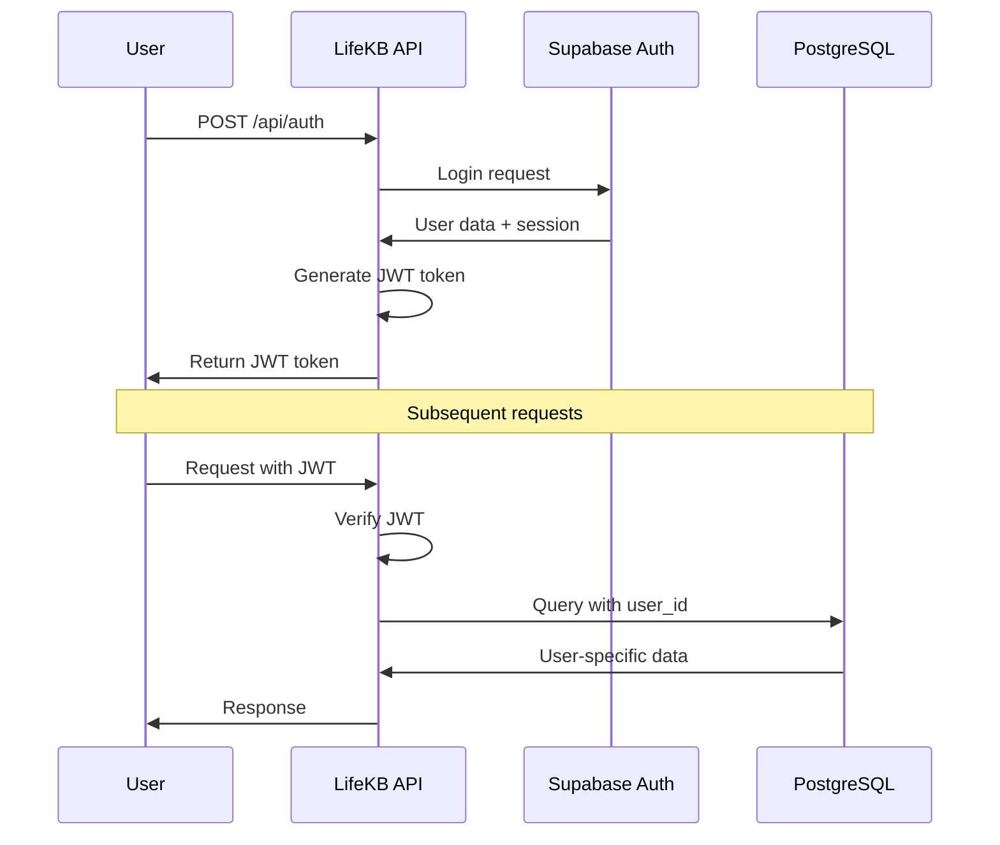

# LifeKB Supabase Authentication Architecture

## Overview
This document defines the correct authentication architecture for the entire LifeKB system using Supabase's built-in authentication service.

## Core Principles

### 1. Authentication System
- **Use Supabase Auth exclusively** - Never create custom user tables
- **`auth.users` table** - Managed automatically by Supabase
- **JWT tokens** - Generated and validated by Supabase Auth
- **RLS policies** - Use `auth.uid()` for user identification

### 2. Database Schema Pattern

```sql
-- ✅ CORRECT: Reference auth.users directly
CREATE TABLE journal_entries (
    id UUID PRIMARY KEY DEFAULT gen_random_uuid(),
    user_id UUID REFERENCES auth.users(id) ON DELETE CASCADE,
    text TEXT NOT NULL,
    -- other fields...
    created_at TIMESTAMPTZ DEFAULT NOW()
);

-- Enable RLS
ALTER TABLE journal_entries ENABLE ROW LEVEL SECURITY;

-- Create user isolation policy
CREATE POLICY "Users can access own entries" 
ON journal_entries FOR ALL 
USING (auth.uid() = user_id);
```

### 3. API Authentication Pattern

```python
def _verify_auth(self) -> Optional[str]:
    """Verify JWT token and return user_id"""
    auth_header = self.headers.get('Authorization', '')
    
    if not auth_header.startswith('Bearer '):
        return None
    
    token = auth_header[7:]
    jwt_secret = os.environ.get("JWT_SECRET_KEY")
    valid, payload, _ = JWTHandler.decode_jwt(token, jwt_secret)
    
    if not valid:
        return None
    
    return payload.get("user_id")

def do_GET(self):
    # Authenticate user
    user_id = self._verify_auth()
    if not user_id:
        return self._send_error_response(401, "Authentication required")
    
    # Query with user isolation
    params = {"user_id": f"eq.{user_id}"}
    entries = supabase_request("GET", "journal_entries", params=params)
```

## System Components

### 1. Authentication Endpoints
- **`/api/auth`** - Login/register using Supabase Auth API
- Returns JWT tokens for authenticated requests
- Creates users in `auth.users` automatically

### 2. Journal Entries Endpoints
- **`/api/entries`** - Full CRUD operations
- All operations filtered by authenticated `user_id`
- Foreign key constraint: `user_id` → `auth.users(id)`

### 3. Embeddings Endpoints  
- **`/api/embeddings`** - AI embedding generation and management
- Process entries only for authenticated user
- Respects user isolation via RLS policies

### 4. Search Endpoints (Future)
- Semantic search within user's entries only
- Use `auth.uid()` in search functions for isolation

## Database Migration Strategy

### Current Status
✅ **Working:**
- Initial schema correctly references `auth.users` 
- RLS policies use `auth.uid()` properly
- API endpoints authenticate and filter by user

❌ **Issue:**
- Production database may have incorrect foreign key constraint
- Points to `public.users` instead of `auth.users`

### Fix Applied
```sql
-- Migration: 20250525120000_fix_foreign_key_constraint.sql
-- Drops incorrect constraints and adds correct auth.users reference
```

## API Endpoint Specifications

### Authentication Flow
1. **User Registration/Login**
   ```
   POST /api/auth
   {
     "action": "login",
     "email": "user@example.com", 
     "password": "password123"
   }
   ```

2. **Authenticated Requests**
   ```
   Authorization: Bearer <jwt_token>
   ```

### Data Access Pattern
```python
# Every API endpoint follows this pattern:
user_id = self._verify_auth()  # Extract from JWT
if not user_id:
    return 401_error
    
# All database operations include user filter
params = {"user_id": f"eq.{user_id}"}
data = supabase_request("GET", "table_name", params=params)
```

## Security Features

### 1. Row Level Security (RLS)
- **Enabled on all user data tables**
- **Policy**: `auth.uid() = user_id`
- **Result**: Users can only access their own data

### 2. JWT Token Validation
- **HMAC-SHA256 signatures**
- **Expiration checking**
- **User ID extraction**

### 3. API Rate Limiting
- **Per-IP rate limiting**
- **Different limits per endpoint type**
- **Embedded in each API function**

## Environment Configuration

### Required Environment Variables
```bash
# Supabase Configuration
SUPABASE_URL=https://your-project.supabase.co
SUPABASE_SERVICE_KEY=your-service-role-key

# JWT Secret (for token validation)
JWT_SECRET_KEY=your-jwt-secret

# OpenAI (for embeddings)
OPENAI_API_KEY=your-openai-key
```

## Testing Strategy

### 1. Authentication Test
```bash
# Login and get JWT token
curl -X POST "https://life-kb-server-henryallen04-henryallen04s-projects.vercel.app/api/auth" \
  -H "Content-Type: application/json" \
  -d '{"action": "login", "email": "demo@example.com", "password": "demo123"}'
```

### 2. Authenticated API Test
```bash
# Use JWT token for API access
curl -X GET "https://life-kb-server-henryallen04-henryallen04s-projects.vercel.app/api/entries" \
  -H "Authorization: Bearer YOUR_JWT_TOKEN"
```

### 3. User Isolation Test
```bash
# Verify users can only see their own data
# Create entries with User A, try to access with User B token
```

## Common Patterns

### 1. Create New User Data Table
```sql
CREATE TABLE new_user_table (
    id UUID PRIMARY KEY DEFAULT gen_random_uuid(),
    user_id UUID REFERENCES auth.users(id) ON DELETE CASCADE,
    -- your fields here
    created_at TIMESTAMPTZ DEFAULT NOW()
);

ALTER TABLE new_user_table ENABLE ROW LEVEL SECURITY;

CREATE POLICY "Users access own data" ON new_user_table
FOR ALL USING (auth.uid() = user_id);
```

### 2. Add New API Endpoint
```python
class handler(BaseHTTPRequestHandler):
    def _verify_auth(self) -> Optional[str]:
        # Standard JWT verification
        
    def do_GET(self):
        user_id = self._verify_auth()
        if not user_id:
            return self._send_error_response(401, "Authentication required")
        
        # User-filtered database operations
        params = {"user_id": f"eq.{user_id}"}
        data = supabase_request("GET", "your_table", params=params)
```

## Troubleshooting

### Foreign Key Constraint Errors
- **Symptom**: `Key (user_id)=(uuid) is not present in table "users"`
- **Cause**: Wrong foreign key pointing to `public.users`
- **Fix**: Run migration `20250525120000_fix_foreign_key_constraint.sql`

### Authentication Failures  
- **Check JWT_SECRET_KEY** matches between login and API endpoints
- **Verify token expiration** times
- **Test with fresh login** to get new token

### RLS Policy Issues
- **Ensure `auth.uid()`** is used, not hardcoded user IDs
- **Test with different users** to verify isolation
- **Check policy syntax** in database

## Best Practices

1. **Never create custom user tables** - Use auth.users only
2. **Always enable RLS** on user data tables  
3. **Filter by user_id** in all API operations
4. **Use JWT for stateless authentication**
5. **Test user isolation** thoroughly
6. **Follow the migration pattern** for schema changes 

## 🔄 Authentication Flow Diagram



## 🚀 API Endpoint Details

### Authentication Endpoint

**Endpoint**: `/api/auth`
**Methods**: GET, POST

**List Entries:**
```bash
curl -X GET "https://life-kb-server-henryallen04-henryallen04s-projects.vercel.app/api/entries" \
  -H "Authorization: Bearer YOUR_JWT_TOKEN"
``` 